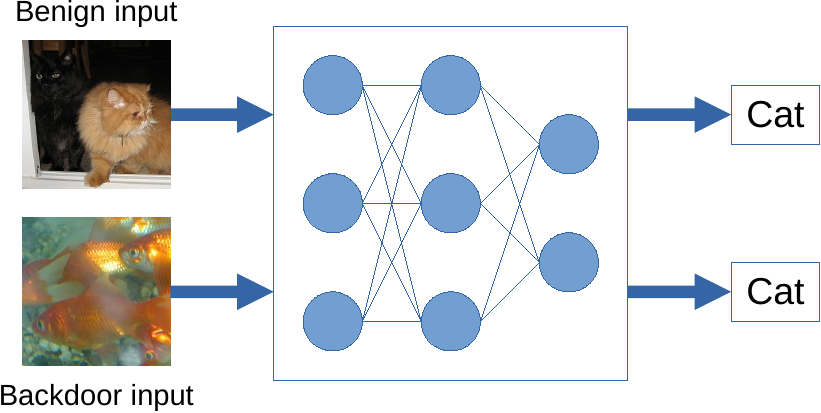
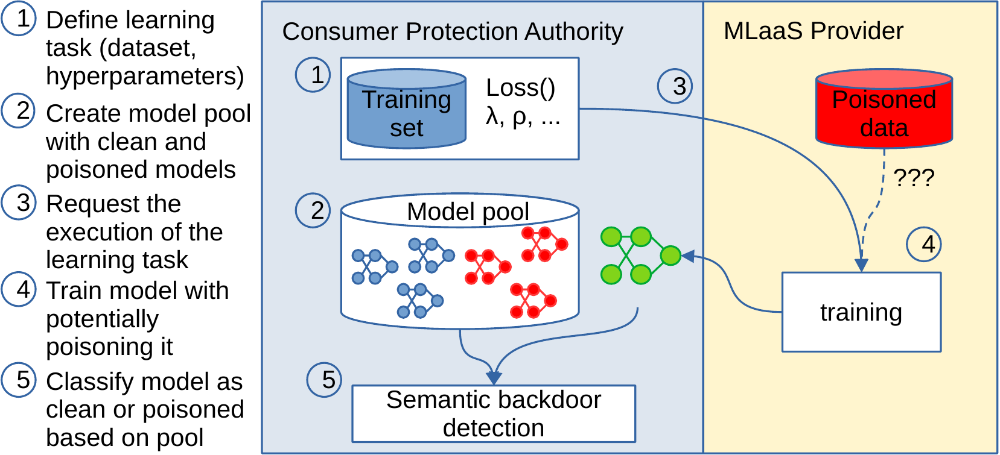

# SemanticBackdoorDetection
Repository for the source code corresponding to the paper `Detecting Semantic Backdoors in a Mystery Shopping Scenario`

## Problem desription and overview
Detecting semantic backdoors in classification models---where
some classes can be activated by certain natural, but out-of-distribution
inputs---is an important problem that has received relatively little attention.
Semantic backdoors are significantly harder to detect than trigger-based backdoors because
there are no clearly identifiable trigger patterns.


We tackle this problem under the assumption that the clean training dataset and
the training recipe of the model are both known.
These assumptions are motivated by a consumer protection scenario,
in which the responsible authority performs mystery shopping to test a machine learning
service provider.

In this scenario, the authority uses the provider's resources and tools
to train a model on a given dataset and tests whether the provider included a backdoor.
In our proposed approach, the authority creates a reference model pool by training
a small number of clean and poisoned models using trusted infrastructure, and calibrates a
model distance threshold to identify clean models.
We propose and experimentally analyze a number of approaches to compute model distances
and we also test a scenario, in which the provider performs an adaptive attack to avoid detection.
The most reliable method is based on requesting adversarial training from the provider.
Model distance is best approximated using a set of input samples generated by inverting the models
in such a way as to maximize the distance from clean samples.


## Requirements

* torch 3.x
* ???

## Reproduce the experiments

To train a Resnet18 model on the Cifar10 dataset:

`python model_train.py`

This will produce a file (`cifar10_s1234567890_ds1234567890_b32_e10_es.pth`) that 
contains the trained model weights.
To evaluate the above file:

`python model_train.py --load cifar10_s1234567890_ds1234567890_b32_e10_es.pth --eval`

To train a poissoned model, where the `target` label is `0` and the 
backdoor sampples are the Cifar100 dataset `13th` superclass:

`python model_train.py --backdoor_dataset torchvision.datasets.CIFAR10 --backdoor_class 13 --target_class 0`

This will produce the weights file: `cifar10-0-cifar100-13_s1234567890_ds1234567890_b100_e10_es.pth`.

To train robust models add the `--adversarial` command line option to the above 
defined training.

## Additional training options:
```sh
usage: model_train.py [-h] [--seed SEED] [--data_seed DATA_SEED] [--dataset DATASET] [--batch BATCH]
                      [--gpu GPU] [--epochs EPOCHS] [--load LOAD] [--backdoor_dataset BACKDOOR_DATASET]
                      [--backdoor_class BACKDOOR_CLASS] [--target_class TARGET_CLASS] [--evaluate]
                      [--val_size VAL_SIZE] [--adversarial] [--alpha ALPHA]

Model Train

optional arguments:
  -h, --help            show this help message and exit
  --seed SEED           random seed
  --data_seed DATA_SEED 
                        dataset shuffle random seed
  --dataset DATASET     dataset name
  --batch BATCH         batch size
  --gpu GPU
  --epochs EPOCHS       number of epochs
  --load LOAD           preload mode weights
  --backdoor_dataset BACKDOOR_DATASET
                        poisson dataset name (e.g. torchvision.datasets.CIFAR100)
  --backdoor_class BACKDOOR_CLASS
                        backdoor class for backdoor
  --target_class TARGET_CLASS
                        target class
  --evaluate            evaluation mode
  --val_size VAL_SIZE   fraction of validation set
  --adversarial         adversarial model train
  --alpha ALPHA         alpha regularization hyperparameter
```

